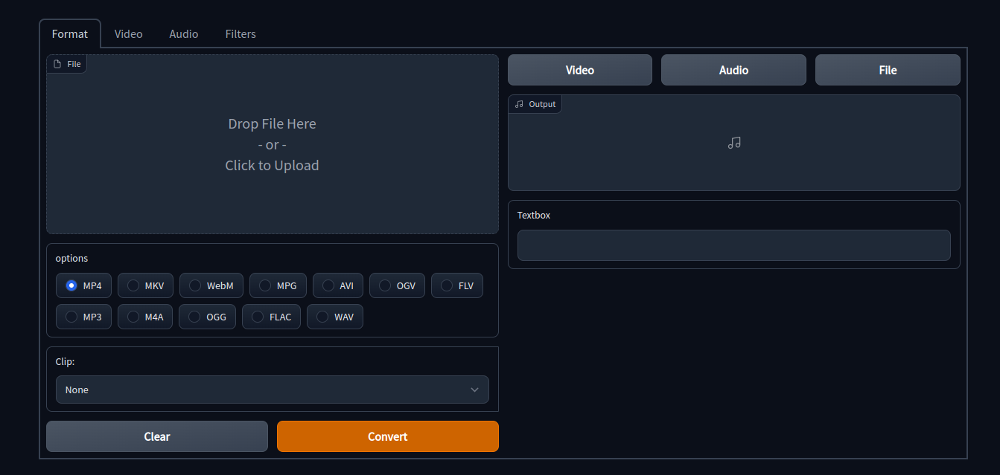

# Overview 
Simple gradio interface for ffmpeg filters and codecs

## Dev
Built with Gradio and ffmpy

inspiration by [ffmpeg-commander](https://www.github.com/alfg/ffmpeg-commander)
# Install
 Clone the repo and 
`pip install -r requirements.txt`
- To run locally

    `gradio app.py`